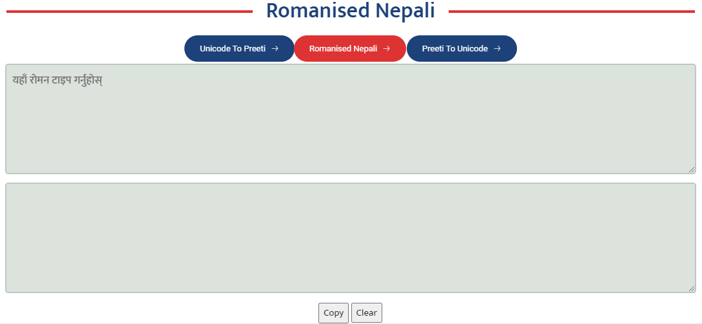
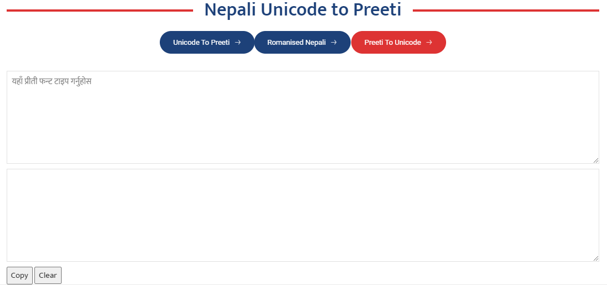
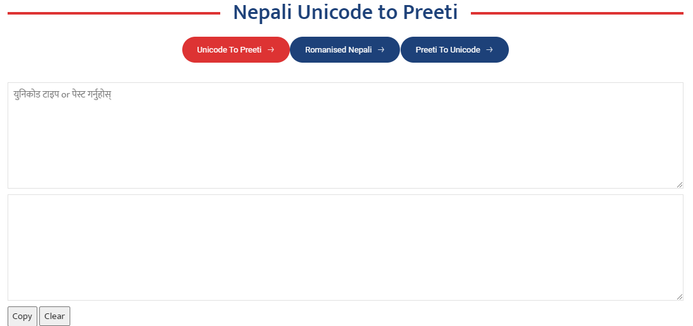

# Nepali Text Conversion Tools

This repository provides a set of tools for Nepali text conversion and utilities, which can be easily embedded into any web page. These tools include:

- Nepali Unicode
- Preeti to Unicode
- Unicode to Preeti
- jQuery and Typing Script Integration
## Embedding Instructions

To integrate these tools into your web page, you can use the provided HTML snippets. Simply copy and paste the relevant code into your HTML file.

### Nepali Unicode

Embed the Nepali Unicode tool using the following code:

```html
<div id="iframe-1"></div>
<script src="https://pradipsubedi1.com.np/assets/embed/roman/script.js"></script>
```

### Preeti to Unicode

To include the Preeti to Unicode conversion tool:

```html
<div id="iframe-1"></div>
<script src="https://pradipsubedi1.com.np/assets/embed/preeti/script.js"></script>
```
### Unicode to Preeti
Use the following snippet to add the Unicode to Preeti conversion tool:

```html
<div id="iframe-1"></div>
<script src="https://pradipsubedi1.com.np/assets/embed/unicode/script.js"></script>
```
### jQuery and Typing Script Integration
If your tool requires jQuery and the typing script, include the following code in your HTML:

```html
<script src="https://pradipsubedi1.com.np/assets/js/jquery-3.7.1.js"></script>
<div id="iframe-1"></div>
<script src="https://pradipsubedi1.com.np/assets/embed/typing/script.js"></script>
```

## Usage

- Copy the HTML Snippet: Choose the appropriate snippet based on the tool you want to embed.
- Paste into Your HTML: Place the snippet into your HTML file where you want the tool to appear.
- Customize as Needed: You can style the container div with id="iframe-1" using CSS to fit your webpage design.

## Screenshots

## Nepali Unicode Tool


## Preeti to Unicode Tool


## Unicode to Preeti Tool


## Installation Help

If you need help with installation or have any questions, feel free to contact me:

- **Phone**: +977 9843944252
- **Email**: info@pradipsubedi1.com.np
