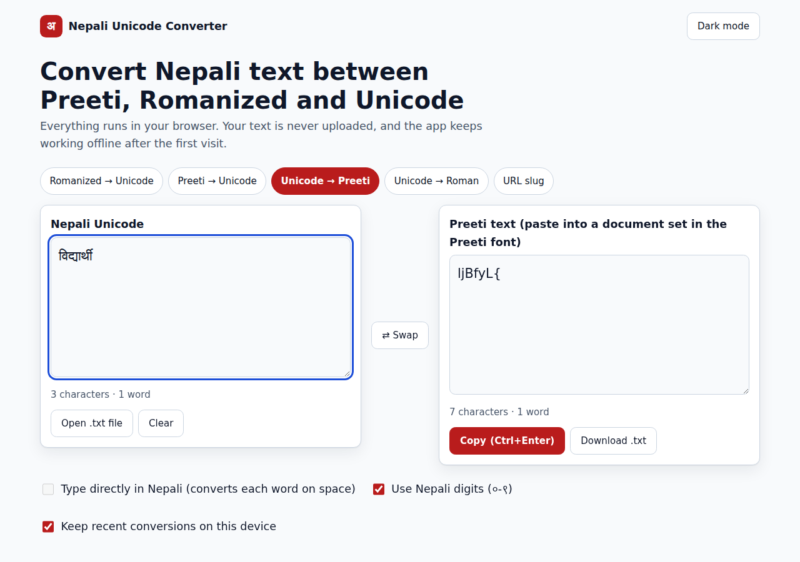
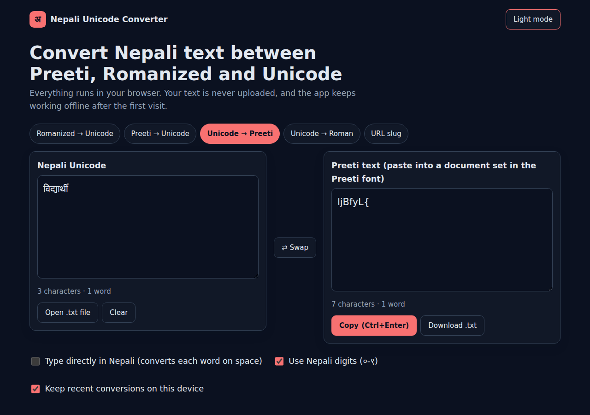
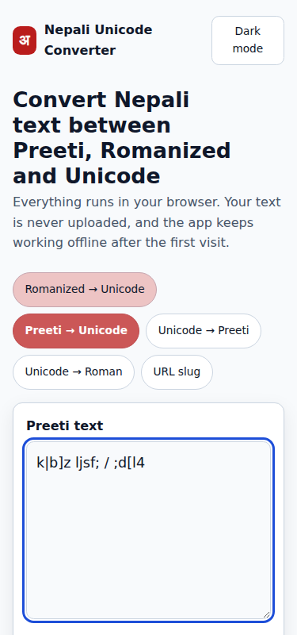
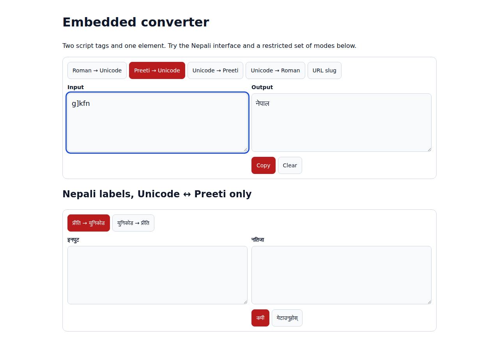

# Nepali Unicode Converter

Convert Nepali text between Preeti, Romanized and Unicode in the browser, in Node, in PHP or inside WordPress. One small library with no dependencies does the work everywhere. It runs entirely on the user's device, so no text is ever uploaded.

[](https://github.com/sprasapradip/unicode-nepali/actions/workflows/ci.yml)




## Table of Contents

<!-- toc -->
- [Features](#features)
- [Installation](#installation)
  - [Web app](#web-app)
  - [Embed on any website](#embed-on-any-website)
  - [Node.js and command line](#nodejs-and-command-line)
  - [PHP and Laravel](#php-and-laravel)
  - [WordPress](#wordpress)
- [Usage](#usage)
  - [JavaScript](#javascript)
  - [PHP](#php)
  - [WordPress](#wordpress-1)
  - [Romanized typing guide](#romanized-typing-guide)
- [Accuracy and limitations](#accuracy-and-limitations)
- [Development](#development)
- [Contributing](#contributing)
- [License](#license)
- [Contact](#contact)
<!-- tocstop -->

## Features

| Feature | Details |
|---|---|
| Preeti → Unicode | Reorders ि and reph (र्), joins half forms, handles conjunct keys (क्ष, त्र, ज्ञ, द्य, श्र…) and Preeti's Devanagari digits |
| Unicode → Preeti | Produces the exact key sequence for documents set in the Preeti font, and round-trips back to the same Unicode |
| Romanized → Unicode | Phonetic typing (`namaste` → नमस्ते, `xetra` → क्षेत्र). `{English}` stays as typed and `\` forces a halant |
| Type in place | The input box converts each word as you press space |
| Unicode → Roman and URL slugs | `नेपालको राजनीतिक समाचार` → `nepalko-rajnitik-samachar` for clean WordPress and Laravel URLs |
| Numbers | Nepali digits both ways, plus lakh/crore grouping: `1234567.5` → `१२,३४,५६७.५` |
| Auto-detect | Spots Preeti or Unicode text pasted into the wrong mode and offers to switch |
| Web app | File open (.txt), download, copy (Ctrl+Enter), swap (Alt+S), recent history, dark mode, deep links (`?mode=`), works offline (PWA) |
| Embed | `<nepali-converter>` web component with English or Nepali labels and a `convert` event |
| PHP / Laravel | `Sprasa\NepaliUnicode\NepaliConverter`, tested to give byte-identical output to the JavaScript library |
| WordPress | `[nepali_converter]` shortcode and optional English slugs for Nepali post titles |
| CLI | `nepali-convert preeti-to-unicode old.txt -o new.txt` |

| Dark theme | Mobile | Embedded |
|---|---|---|
|  |  |  |

## Installation

### Web app

Open `index.html`, or host the folder on any static host (GitHub Pages, Netlify, cPanel). Once GitHub Pages is enabled for this repository, the app is available at <https://sprasapradip.github.io/unicode-nepali/>.

### Embed on any website

```html
<script src="https://cdn.jsdelivr.net/gh/sprasapradip/unicode-nepali@v2.0.0/src/nepali-converter.js"></script>
<script src="https://cdn.jsdelivr.net/gh/sprasapradip/unicode-nepali@v2.0.0/embed/nepali-converter-element.js"></script>

<nepali-converter mode="preeti-to-unicode"></nepali-converter>
```

| Attribute | Values | Default |
|---|---|---|
| `mode` | `roman-to-unicode`, `preeti-to-unicode`, `unicode-to-preeti`, `unicode-to-roman`, `slug` | `roman-to-unicode` |
| `modes` | Comma-separated list of tabs to show | all modes |
| `lang-ui` | `en`, `ne` | `en` |
| `theme` | `auto`, `light`, `dark` | `auto` |

```js
document.querySelector('nepali-converter')
  .addEventListener('convert', (e) => console.log(e.detail.output));
```

### Node.js and command line

```bash
git clone https://github.com/sprasapradip/unicode-nepali.git
cd unicode-nepali
node bin/nepali-convert.js preeti-to-unicode notice.txt -o notice-unicode.txt
echo "mero naam pradiip ho" | node bin/nepali-convert.js roman-to-unicode
node bin/nepali-convert.js number 1234567.5
```

### PHP and Laravel

Add the repository to `composer.json`, then require the package:

```bash
composer config repositories.unicode-nepali vcs https://github.com/sprasapradip/unicode-nepali
composer require sprasapradip/unicode-nepali:^2.0
```

The package needs PHP 8.1+ with `mbstring`. `intl` is optional and used for Unicode normalisation.

### WordPress

Run `sh scripts/sync-wordpress.sh` to build `dist/nepali-unicode-converter.zip`, then upload it under **Plugins → Add New → Upload Plugin**. The plugin source is in [wordpress/nepali-unicode-converter](wordpress/nepali-unicode-converter/readme.txt).

## Usage

### JavaScript

```js
const N = require('./src/nepali-converter.js');   // browser: window.NepaliConverter

N.preetiToUnicode('g]kfn ;/sf/');          // 'नेपाल सरकार'
N.unicodeToPreeti('विद्यार्थी');            // 'ljBfyL{'
N.romanToUnicode('namaste {Laravel}');     // 'नमस्ते Laravel'
N.slugify('नेपाल समाचार');                 // 'nepal-samachar'
N.formatNumber(1234567.5);                 // '१२,३४,५६७.५'
N.detect('g]kfn');                         // { type: 'preeti', confidence: 1 }
N.convert(text, 'preeti-to-unicode');      // any mode by name
```

### PHP

```php
use Sprasa\NepaliUnicode\NepaliConverter;

NepaliConverter::preetiToUnicode('g]kfn ;/sf/');   // 'नेपाल सरकार'
NepaliConverter::slugify($post->title_ne);           // 'nepal-samachar'
NepaliConverter::formatNumber(1234567.5);            // '१२,३४,५६७.५'
```

### WordPress

```text
[nepali_converter mode="preeti-to-unicode"]
[nepali_converter modes="preeti-to-unicode,unicode-to-preeti" lang="ne"]
```

To turn on English slugs for Nepali titles, go to **Settings → Writing → Nepali slugs**. In theme templates, use `nuc_convert( $text, 'preeti-to-unicode' )`.

### Romanized typing guide

| Type | Gets | Type | Gets |
|---|---|---|---|
| `aa` / `A` | आ ा | `ii` / `ee` / `I` | ई ी |
| `uu` / `oo` / `U` | ऊ ू | `e`, `ai`, `o`, `au` | ए ऐ ओ औ |
| `T Th D Dh N` | ट ठ ड ढ ण | `t th d dh n` | त थ द ध न |
| `sh` / `Sh` | श ष | `x` / `ksh` | क्ष |
| `gy` / `tr` | ज्ञ त्र | `Ri` | ऋ ृ |
| `M` / `~` / `H` | ं ँ ः | `.` | । |
| `\` | halant ् | `{text}` | kept as typed |

A word ending in a consonant keeps its inherent "a", so `nepaal` gives नेपाल and `bhagawaan\` gives भगवान्.

## Accuracy and limitations

- **Preeti mapping** covers the standard Preeti layout, including its conjunct and Alt-code glyphs. Some Preeti font builds differ on a few rare symbols. If a character converts wrongly, open an issue with the original text.
- **Unicode → Preeti** output is plain ASCII. It only looks like Nepali when the text is set in the Preeti font.
- **Unicode → Roman** is a readable approximation for URLs and search, not a formal transliteration standard.
- **Latin letters** inside Unicode → Preeti input stay as they are, and Preeti will display them as Devanagari glyphs. Keep English text in a separate font.

## Development

```bash
node --test                    # JavaScript tests + JS/PHP parity test
php tests/php/run.php          # PHP port against tests/fixtures.json
sh scripts/sync-wordpress.sh   # copy library files into the plugin and build the zip
```

CI runs the suites on Node 18 and 22 and on PHP 8.1 and 8.3. It also checks that the plugin's copies of the library stay in sync.

```text
src/nepali-converter.js            core library (browser + Node)
embed/nepali-converter-element.js  <nepali-converter> web component
assets/app.js                      web app controller
php/src/NepaliConverter.php        PHP port (Composer, PSR-4)
wordpress/nepali-unicode-converter WordPress plugin
bin/nepali-convert.js              command-line tool
tests/                             fixtures, Node tests, PHP runner
```

## Contributing

Issues and pull requests are welcome. If you add a Preeti mapping, add the word to `tests/fixtures.json`. Both the JavaScript and PHP suites must pass.

## License

All rights reserved © Pradip Subedi. Contact the author for licensing.

## Contact

Pradip Subedi ([@sprasapradip](https://github.com/sprasapradip)): [info@pradipsubedi1.com.np](mailto:info@pradipsubedi1.com.np) · [pradipsubedi1.com.np](https://pradipsubedi1.com.np)
